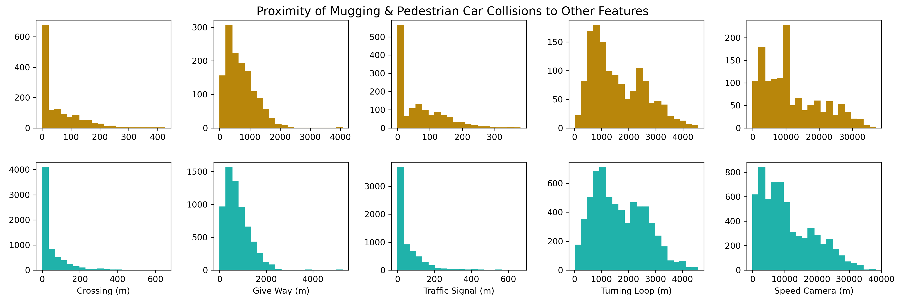
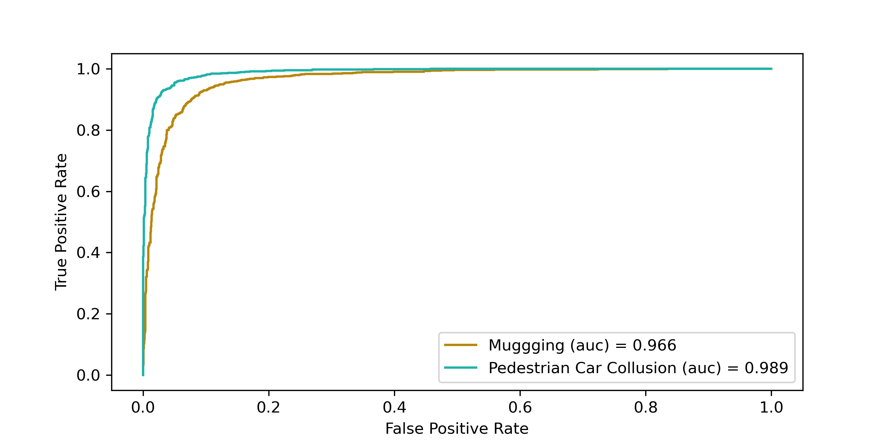

# CityTrek

Imagine you had an unexpected layover in Toronto,
 you would like to **walk**  from the Casa Loma to the CN tower,
 but you have no idea whether the path your navigation 
 application has recommended is comfortable or safe. 
 Want a better option?
 **CityTrek** is the application for you! 
 
 **CityTrek** takes your comfort 
 (e.g., preferences for shady or flatter paths)
 and safety (e.g., risk of mugging and car collision) preferences
 and recommends an optimized path compared to the shortest path.
 **CityTrek** will also provide details on 
 how this optimized path compares to the shortest path, in terms
 of distance and walking time. 
 
 Because we understand that crime data (e.g., mugging) is highly
 biased, which could result in paths that avoid marginalized 
 neighbourhoods, **CityTrek** places a much 
 lower weight on this feature compared to the others. Simply,
 marginalized communities are often over-policed, which 
 leads to [higher incidences of reported of crimes](https://www.jstor.org/stable/41954178?seq=1).
This bias in the data would result in the model predicting that
such neighbourhoods are unsafe, when in fact, they are simply
over-policed.
 
 The other weights (i.e., distance, hilliness, risk of pedestrian car collision, shadiness)
 are given equal value in the application. Importantly, the metric used to measure shadiness
 does not take into consideration time of day. Check out 
 [Parasol](https://blog.insightdatascience.com/parasol-navigation-optimizing-walking-routes-to-keep-you-in-the-sun-or-shade-1be7a4fde97), 
 which is an application made by a past Insight Data Science Fellow that plots your path based on 
 shade preferences - it takes into consideration the time of day.

## Data
I use two main data sources -  [digital terrain models](https://www.nrcan.gc.ca/science-and-data/science-and-research/earth-sciences/geography/topographic-information/whats-new/high-resolution-digital-elevation-model-hrdem-generated-lidar-new-data-available/22350) 
from the Government of Canada and [pedestrian collisions](https://data.torontopolice.on.ca/datasets/robbery-2014-to-2019) 
and [robbery events](https://data.torontopolice.on.ca/datasets/pedestrians) 
from the City of Toronto Police. The digital terrain models were created in 2015,
and has a 1-meter resolution. The robbery data includes occurrences between 2014-2019,
while the pedestrian car collision events were between 2006-2019. 

### Deriving Comfort Metrics
To derive the comfort metrics, I processed the digital terrain models in 
both ArcMap and QGIS. The first step was to merge the raster images,
and this included areas in and around the City of Toronto.
Next, I generated a [hillshade](https://desktop.arcgis.com/en/arcmap/10.3/manage-data/raster-and-images/hillshade-function.htm),
raster layer, which is simply a hypothetical measure of how much sun gets to a cell. 
This is based on the slope and aspect of the neighbouring cells. Thus, a cell that  
has no landscape elements next to it that are of a higher slope/aspect
will, theoretically, have more sunlight exposure.  I then derived a
[roughness](https://docs.qgis.org/3.4/en/docs/user_manual/processing_algs/gdal/rasteranalysis.html#gdalroughness) 
raster layer, which is the degree of irregularity in a surface.

### Deriving Safety Metrics
Next, I web scraped the City of Toronto Police data and commenced cleaning, exploration
and preparation for predictive modelling. For the robbery data, I selected events that occurred outside
and were tagged as muggings - this is most relevant to pedestrians. For the pedestrian car collisions,
I removed events that occurred on roads with road types with fewer than 10 observations.
I then needed to generate psedoabsences, which I did in ArcGIS by creating random points 
along the entire road network of the City of Toronto. After finding measuring priority of
each event to the nearest traffic signal, stop sign, turning loop, etc (in GIS), I then used
one-hot encoding to generate some dummy variables and balanced my classes. 

*Figure 1. Distribution of how close mugging (top) and 
pedestrian car collisions (bottom)occurred to crossings, give ways, traffic signals, turrinign loops and
speed cameras in the City of Toronto*

#### Predicting Mugging and Pedestrian Car Collision Risk
I built both a Logistic Regression and Random Forest models to predict the risk
of mugging and pedestrian car collisions. I was interested in comparing performance between
a simpler, more interpretable model (i.e., logistic regression) and a more complex, but powerful,
model. Note, I did not consider Naive Bayes because this model assumes independence of features, which
my data did violate (and I had a large sample size). In the end, after some model tuning, Random Forest models
had higher accuracy. Thus, I chose this model to predict saftey metrics in the web application. 

*Figure 2. Area Under Receiver Operator Curve for Random
Forest Models that predict the probability of mugging and pedestrian
car collision in the City of Toronto*
